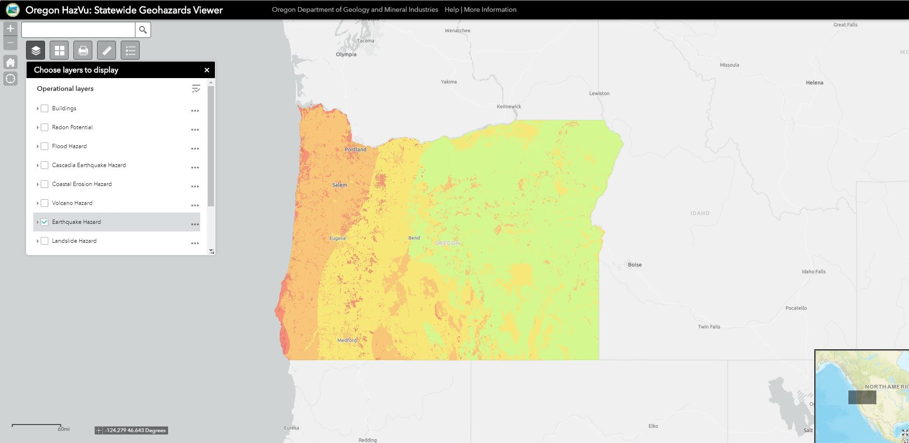
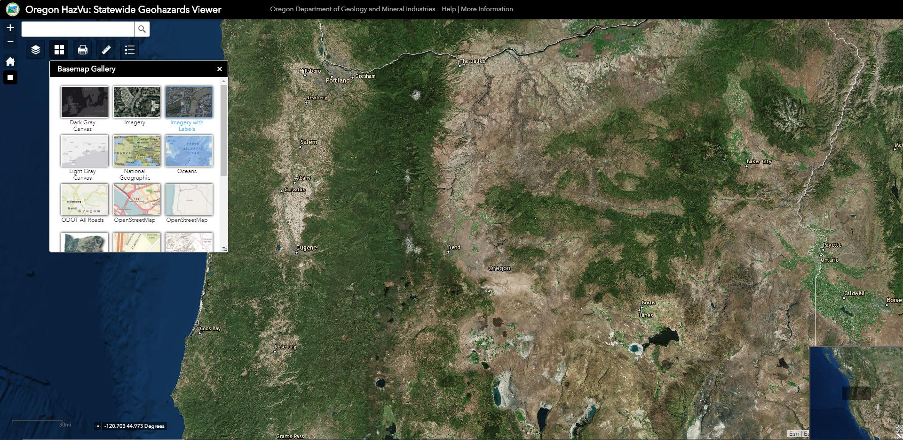
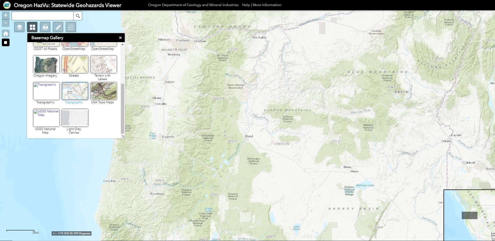
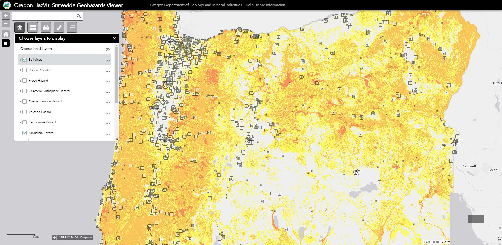
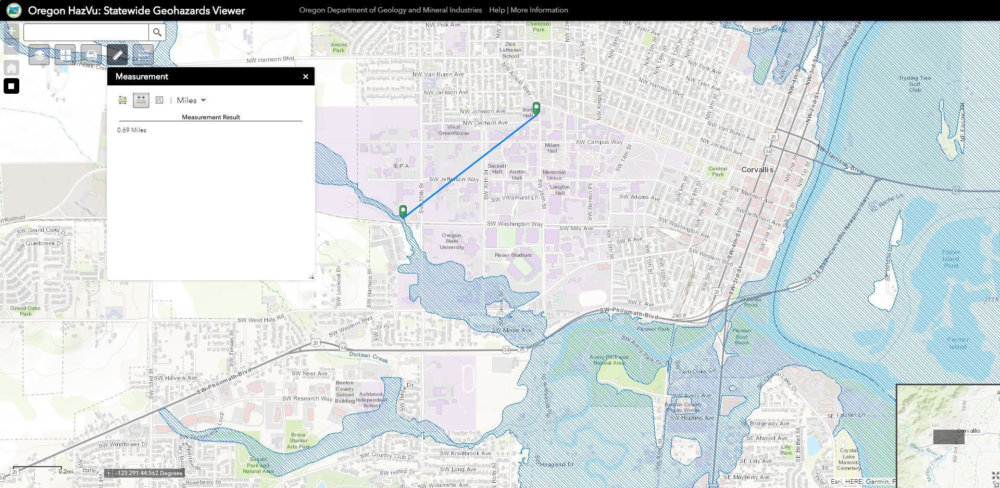

# Final Project

>Critique by Connor Anderson

## Introduction:

This is a review of the [Oregon HazVu: Statewide Geohazard Viewer][1] created by the Department of Geology and Mineral Industries (DOGAMI) on October 1, 2012, using the ESRI ArcGIS server. HazVu is meant to provide the public with an interactive map that shows the locations of many different geologic hazards within the state of Oregon. Anyone can search for a place or address to view the geohazards that are likely to affect the area. For instance, the user can search their address and overlay the Earthquake Hazard layer to see the severity of the expected earthquake shake surrounding their home. The web map uses various libraries including javascript (js), cascading style sheets (css), and HTML to create the hazard map with several basic map functions (search bar, clickable popups, etc.).

>Fig.1: Earthquake Hazard layer for the state of Oregon.
---

## Body:

**Systemic Architecture:**

The architecture of the interactive HazVu map begins with a web client search (Google Chrome). This search brings you to the Oregon Department of Geology and Mineral Industries (DOGAMI) GIS hazards web server (gis.dogami.oregon.gov). The DOGAMI web server then takes the user to the ESRI ArcGIS Server that host the HazVu iteractive map (geo.maps.arcgis.com).

**Web Map Design:**

The web maps design is streamline and easy to use. However, I believe the map can be better organized. All the web map’s interactive elements are piled up in the upper left-hand corner and could benefit from being spread out in a more organized layout across the window. Other than layout organization, this map design makes it easy for users to explore the map and gain more knowledge about Oregon’s various geohazards.

**Data Sources:**

The interactive HazVu map mostly contains vector data files. The various hazard layers include vector JSON files from DOGAMI or other organizations that monitor the natrual hazards of Oregon. The provided basemap layers are in the form of vector tile layers (ArcGISTiledMapServiceLayer) rather than raster tile layers.

**Basemaps:**

HazVu opens with a standard gray canvas basemap from ESRI but has several basemaps compiled within a gallery for the customization of the user’s experience. The basemap inventory contains canvas maps, satellite imagery, topographic/terrain, and open street maps.

>Fig.2: Satellite Imagery basemap

---

>Fig.3: Topographic basemap
---

**Thematic Layers:**

Each thematic layer or operational layer of the map shows the locations of different geohazards. These layers include buildings, radon potential, flood hazard, Cascadia earthquake hazard, coastal erosion hazard, volcano hazard, earthquake hazard, landslide hazard, landslide inventory, highest hit lidar hillshade, and bare earth lidar hillshade. The user has the option of looking at one or multiple layers at a time.

>Fig.4: Building layer on top of the Landslide Hazard layer.
---

**Interactive Features:**

The map provides various interactive tools to aid in understanding the subject matter. For instance, the audience can use the search bar to zoom the frame to a specified location or use the My Location button to zoom to their current location. If the user would like to zoom out to the default overview of Oregon, they can click the default extent button. You also have the option to measure the area of a specified polygon, the distance between two or more placed points (hazard distance) or find the coordinates of a single point with the provided measurement tool. You can select the print button if you would like to save a screenshot of the map content as a pdf, jpg, etc.

>Fig.5: Distance measured from Wilkinson Hall to nearest flood hazard.
---

**Map Elements:**

The web map has several elements including a zoom tool and search bar on the upper left, a scale bar and coordinate display on the lower left, an inset overview map on the lower right, and a legend menu that loads beneath the search bar once a thematic layer is selected.

**Responsive Design:**

This specific map does support a responsive design. The user can explore the hazard map on a desktop computer as well as their mobile devices (phone or tablet).

## Discussion & Conclusion:

The Oregon HazVu map provides the audience with user-friendly tools to create and explore a hazard map unique to their situation. In summary, DOGAMI has made it easier for the public to explore and educate themselves on the extent of local geologic hazards.

**Any room for future development?**

The map could include more numerical data and make data retrieval easier by adding links to data sources within the hazard layers or clickable popups. I would also like to see them add a fixed legend to the upper right corner of the screen that updates to whatever layers are active. The search function should also be modified so the search bar drop down menu disappears after the search begins (after clicking the search button). Otherwise, it seems well developed and even includes a link to a well organized help/information page. 

**Take-home message:**

The data provided should not be used for professional purposes but rather be used by the public to learn more about how different geologic hazards might affect you and your surroundings.

---
## References:

1) HazVU Intro page: https://www.oregongeology.org/hazvu/
2) DOGAMI HazVu Map: https://gis.dogami.oregon.gov/maps/hazvu/

[1]:  https://gis.dogami.oregon.gov/maps/hazvu/ "DOGAMI HazVu Map"
